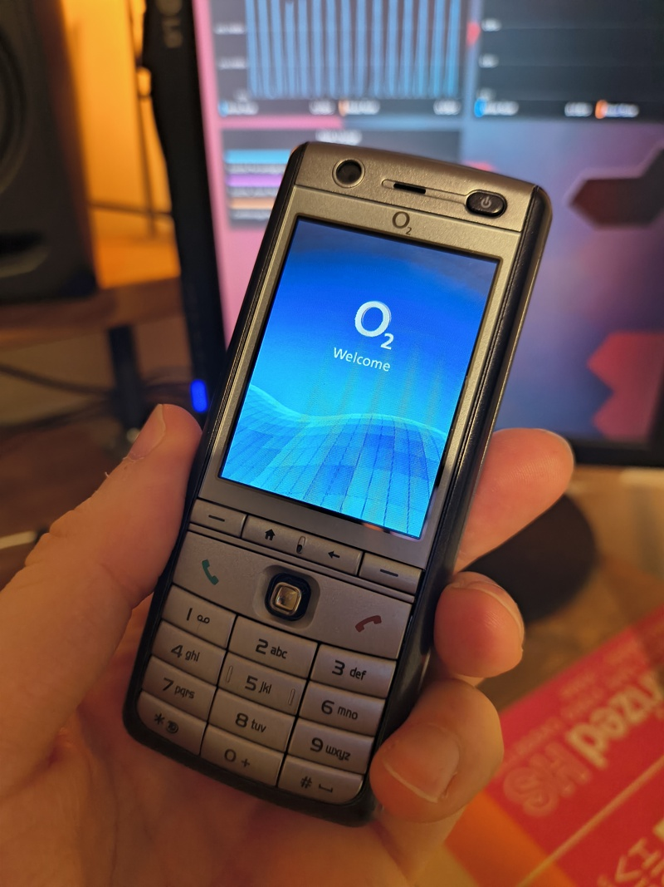

Repository for attempting to get Linux running on the
[O2 XDA Graphite (aka ASUS Jupiter)](https://phonedb.net/index.php?m=device&id=663&c=o2_xda_graphite__asus_jupiter).

## Overview

The O2 XDA Graphite is a Windows Mobile-based "candy bar" phone released in 2007. I got it for my birthday at 14
years old, and happen to think it looks stylish as hell.

This isn't the phone I originally got (I once left that outside overnight in my shoe next to my cousin's trampoline,
and the moisture ruined the screen), but I somehow managed to find someone selling one on eBay a year or two ago.

The phone runs on an Intel XScale PXA 270 CPU at 416 MHz, and has 64MB of RAM. It supports Wi-Fi 802.11b/g and
Bluetooth 1.2, and has a Micro SD card slot behind its replaceable battery!

I would like to be able to write my own applications for the phone, and ideally do away with Windows Mobile completely.
The UI is clunky, it would require an ancient version of Microsoft ActiveSync to send files to the phone, and would
require an even more ancient set of compiler tools to build applications for it.

After a brief exploration of the feasible options, I discovered that the [HaRET](https://xdandroid.com/wiki/HaRET)
utility can essentially act as a soft-jailbreak for the phone, completely wiping Windows Mobile from the phone's
RAM and executing Linux instead. This approach is beneficial from a few angles:

* It allows Windows Mobile to boot up and initialise all of the phone's hardware before Linux takes over, removing the
  need to reverse-engineer the configuration.
* It does not touch the phone's ROM at all, booting solely from the Micro SD card and thereby removing any risk of
  bricking the phone.
* It can just run modern (embedded) Linux, allowing me to use whatever modern toolchains I like that are able to target
  the XScale architecture.

Once Linux is running, I should be able to write applications using graphics libraries such as
[DirectFB](https://directfb2.github.io/) or [LVGL](https://lvgl.io/), which can write directly to the device's
frame buffer.

## Tech Stack

The technologies used here are:

* HaRET
  * GitHub: https://github.com/haret/haret
  * Overview: https://xdandroid.com/wiki/HaRET
  * Instructions for building and modifying: https://wiki.nura.eco/wiki/User:Illen/HaRET
* Buildroot
  * GitHub: https://github.com/buildroot/buildroot
  * Manual: https://buildroot.org/downloads/manual/manual.html

## Building

For build instructions, see [build.md](build.md).
